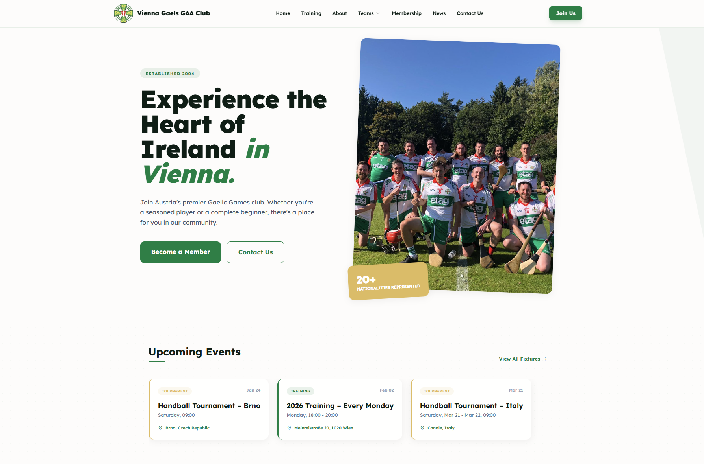

# Vienna Gaels GAA WordPress Theme

A modern, responsive WordPress theme built for the Vienna Gaels Gaelic Athletic Association club. Features a clean design with Tailwind CSS and custom post types for events management.



## Features

- 🎨 Modern design with Tailwind CSS (self-hosted, optimized build)
- 📱 Fully responsive (mobile, tablet, desktop)
- 🌙 Dark mode CSS support
- 📅 Custom Events post type with start/end dates and times
- 🏷️ Manageable Event Types taxonomy (Training, Tournament, Social, etc.)
- 👥 Team pages with featured images
- 📝 Contact form with AJAX submission
- 💳 Membership page with pricing tiers
- 🎯 Optimized for GAA sports clubs
- ♿ Accessible and SEO-friendly
- 🔗 Spond integration for event registration
- 📋 Dropdown navigation menus with hover intent
- ⚙️ Fully customizable via WordPress Customizer (no hardcoded content)

## Prerequisites

- WordPress 5.0+
- PHP 7.4+
- Node.js 18+ (for development only)

## Installation

### 1. Download & Upload Theme

1. Download the theme files
2. Upload to `wp-content/themes/vienna-gaels/`
3. Activate the theme in WordPress Admin → Appearance → Themes

### 2. Build CSS (First Time Setup)

```bash
# Navigate to theme folder
cd wp-content/themes/vienna-gaels

# Install dependencies
npm install

# Build production CSS
npm run build
```

### 3. Initial WordPress Setup

1. Go to **Settings → Permalinks** and click "Save Changes" (flushes rewrite rules)
2. Go to **Appearance → Menus** and create your navigation menus
3. Go to **Appearance → Customize** to configure homepage and header settings

## Development

### Prerequisites
- Node.js 18+ ([Download](https://nodejs.org))

### Setup
```bash
npm install
```

### Development Workflow
```bash
npm run dev  # Watch for changes and auto-rebuild CSS
```

Leave this running while you develop. It watches your PHP files and `src/style.css` for changes.

### Build for Production
```bash
npm run build  # Creates minified, optimized CSS
```

**Important:** Always run `npm run build` before committing changes!

## Required Setup

### 1. Create Menus
- Go to **Appearance → Menus**
- Create a "Primary Menu" and assign to "Primary Menu" location
- Create a "Footer Menu" and assign to "Footer Menu" location

### 2. Create Required Pages
Create these pages with the specified slugs:

- **Home** (set as static front page in Settings → Reading)
- **Contact** (use "Contact Page" template)
- **Membership** (use "Membership Page" template)
- **Men's Football** (slug: `mens-football`)
- **Ladies Football** (slug: `ladies-football`)
- **Hurling** (slug: `hurling`)
- **Camogie** (slug: `camogie`)
- **Handball** (slug: `handball`)

### 3. Upload Logo
- Go to **Appearance → Customize → Site Identity**
- Upload your club logo (recommended: 300x300px)

### 4. Set Hero Image
- Go to **Appearance → Customize → Homepage Hero**
- Upload hero image (recommended: 1200x1500px)

### 5. Configure Homepage Buttons
- Go to **Appearance → Customize → Homepage Hero**
- Edit button text and URLs
- Or go to **Header CTA Button** to edit the top-right button

## Custom Post Types & Taxonomies

### Events
Add training sessions, matches, and social events:
- Go to **Events → Add New**
- Fill in event details (start/end dates, times, location)
- Assign event type from the sidebar
- Optional: Add Spond event URL
- Events appear on homepage (3 most recent) and events archive page

### Event Types (Taxonomy)
Manage event categories:
- Go to **Events → Event Types**
- Add custom types like "Training", "Tournament", "Social", "Fundraiser", "AGM"
- Event types automatically appear in:
  - Event creation sidebar
  - Events archive filter buttons
  - Homepage event cards

**Styling:**
- Event types containing "tournament" get **gold** styling
- All other types get **green** styling

## Page Templates

- **Default Template** - Standard page layout
- **Contact Page** - Contact form with information cards
- **Membership Page** - Pricing tiers with FAQ section

## Customization

### Theme Customizer Options

**Homepage Hero Section:**
- Hero Image
- Headline Text
- Description Text
- Primary Button (text & URL)
- Secondary Button (text & URL)

**Header CTA Button:**
- Show/Hide Toggle
- Button Text
- Button URL

**Social Media Links:**
- Facebook, Twitter, Instagram, YouTube

### Colors

Colors are defined in `tailwind.config.js`:
```javascript
colors: {
    "primary": "#008040",        // Main green
    "vienna-gold": "#DDBB5C",    // Accent gold
}
```

After changing colors, run `npm run build`.

### Fonts

Theme uses **Lexend** font family (loaded from Google Fonts).

## File Structure

```
vienna-gaels/
├── src/
│   └── style.css             # Source CSS (Tailwind + custom styles)
├── assets/
│   ├── css/
│   │   └── style.css         # Generated CSS (don't edit directly)
│   └── js/
│       └── scripts.js        # JavaScript functions
├── package.json              # Node dependencies
├── tailwind.config.js        # Tailwind configuration
├── style.css                 # WordPress theme header
├── functions.php             # Theme functions & setup
├── index.php                 # Blog archive
├── front-page.php           # Homepage template
├── header.php               # Header & navigation
├── footer.php               # Footer
├── single.php               # Single blog post
├── single-events.php        # Single event
├── page.php                 # Default page
├── page-contact.php         # Contact page template
├── page-membership.php      # Membership page template
├── archive-events.php       # Events archive
├── 404.php                  # Error page
├── screenshot.png           # Theme screenshot
├── README.md                # This file
├── DOCUMENTATION.md         # Full user documentation
└── .gitignore               # Git ignore rules
```

## User Documentation

**For Committee Members:**
- WordPress Admin Help: Go to **Website Help** in the admin sidebar
- Full Documentation: [DOCUMENTATION.md](https://github.com/Shane24/Vienna-Gaels-Wordpress-Theme/blob/main/DOCUMENTATION.md)

## Deployment

### Before Deploying to Production:

1. Build optimized CSS:
   ```bash
   npm run build
   ```

2. Commit generated CSS:
   ```bash
   git add assets/css/style.css
   git commit -m "Build production CSS"
   ```

3. Push to repository:
   ```bash
   git push
   ```

**Note:** Committee members don't need Node.js. You build the CSS, they edit content in WordPress.

## Browser Support

- Chrome (latest)
- Firefox (latest)
- Safari (latest)
- Edge (latest)
- Mobile browsers (iOS Safari, Chrome Mobile)

## Performance

- Optimized Tailwind CSS (~50KB minified, vs 3MB CDN)
- Cache busting with `filemtime()`
- Lazy loading for images
- Minimal external dependencies

## Troubleshooting

### CSS Not Updating

**Solution:**
1. Make sure `npm run dev` is running (for development)
2. Hard refresh browser: `Ctrl+Shift+R` (Windows) or `Cmd+Shift+R` (Mac)
3. Check `assets/css/style.css` was generated

### Build Fails

**Solution:**
```bash
# Remove node modules and reinstall
rm -rf node_modules package-lock.json
npm install
npm run build
```

### Events Not Showing

**Solution:**
1. Make sure event has a **Start Date** in the future
2. Check event is **Published** (not Draft)
3. Verify event type is assigned

### Menu Dropdowns Not Working

**Solution:**
1. Make sure child items are indented in **Appearance → Menus**
2. Drag items slightly to the right under parent item
3. Click "Save Menu"

## Support

- **Documentation:** [DOCUMENTATION.md](https://github.com/Shane24/Vienna-Gaels-Wordpress-Theme/blob/main/DOCUMENTATION.md)
- **Issues:** [GitHub Issues](https://github.com/Shane24/Vienna-Gaels-Wordpress-Theme/issues)
- **Repository:** [GitHub](https://github.com/Shane24/Vienna-Gaels-Wordpress-Theme)

## Credits

- Built for [Vienna Gaels GAA](https://viennagaels.com)
- Tailwind CSS - https://tailwindcss.com
- Google Fonts - https://fonts.google.com
- Material Symbols - https://fonts.google.com/icons

## License

This theme is licensed under the GNU General Public License v2 or later.

## Changelog

### Version 1.0 (January 2025)
- Initial release
- Custom Events post type with date/time ranges
- Event Types taxonomy
- Homepage customizer integration
- Dropdown navigation menus
- Spond integration
- Contact form with AJAX
- Membership page template
- Responsive design
- Self-hosted Tailwind CSS build process

---

**Version:** 1.0  
**Author:** Vienna Gaels Web Team  
**Requires WordPress:** 5.0+  
**Tested up to:** 6.4  
**Requires PHP:** 7.4+  
**License:** GPLv2 or later